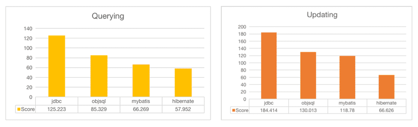

I'm very sorry about the lack of concern about this library Recently. So busy in doing other things and I have no time to maintain it. I will be back in 2 about months. Thanks everyone!(20200120)

近期其他事过于繁忙，以致没时间维护这个库了。很抱歉，不能更新和回答大家的问题。我会在大约两个月后回来继续更新维护它。谢谢大家的支持！(20200120)


ObjectiveSQL is an ORM framework in Java based on ActiveRecord pattern, which encourages rapid development and clean, codes with the least, and convention over configuration.


### Features

- With one annotation your `Class` has fully featured capabilities of SQL programming
- Easy to relational(`has_one`, `has_many` and `belongs_to`) query and paged query
- Writing SQL expressions(`arithmetic`, `comparison` and `logical`) using Java syntax

### Why to choose

- If your project focuses on data analysis based on relation database, and a lot of arithmetic expressions in SQL statement. ObjectiveSQL will help you write expressions conveniently and safely using Java syntax
- If you don’t want to write Java codes of database access and various configuration files, ObjectiveSQL's dynamic code generation will help you access the database without coding

### Performance(Oracle JMH)



### Installation

##### IntelliJ IDEA plugin installation

`Preferences/Settings` -> `Plugins` -> `Search with "ObjectiveSql" in market` -> `Install`

##### Maven dependencies

```xml
<!-- In standalone -->
<dependency>
    <groupId>com.github.braisdom</groupId>
    <artifactId>objective-sql</artifactId>
    <version>1.4.6</version>
</dependency>
```

```xml
<!-- In Spring Boot -->
<dependency>
  <groupId>com.github.braisdom</groupId>
  <artifactId>objsql-springboot</artifactId>
  <version>1.3.4</version>
</dependency>
```

Refer to the [pom.xml](https://github.com/braisdom/ObjectiveSql/blob/master/examples/mysql/pom.xml#L67) for more configuration

### Examples

ObjectiveSQL provides full example for various databases below, You can open it directly with IntelliJ IDEA as a standalone project. In fact, they are not just examples, but also unit tests of ObjectiveSQL in various databases.

If you want to run without configuration, you can try: [SQLite](https://github.com/braisdom/ObjectiveSql/tree/master/examples/sqlite)

Others: [MySQL](https://github.com/braisdom/ObjectiveSql/tree/master/examples/mysql),  [Oracle](https://github.com/braisdom/ObjectiveSql/tree/master/examples/oracle),  [MS SQL Server](https://github.com/braisdom/ObjectiveSql/tree/master/examples/sqlserver), [PostgreSQL](https://github.com/braisdom/ObjectiveSql/tree/master/examples/postgres),  [Spring Boot](https://github.com/braisdom/ObjectiveSql/tree/master/examples/springboot-sample)

#### Simple SQL programming without coding

> You define just a JavaBean with one annotation
```java
@DomainModel
public class Member {
    private String no;
    
    @Queryable
    private String name;
    private Integer gender;
    private String mobile;
    private String otherInfo;

    @Relation(relationType = RelationType.HAS_MANY)
    private List<Order> orders;
}
```

##### Persistence

```java
Member.create(newMember);
Member.create(new Member[]{newMember1, newMember2, newMember3}, false);

Member.update(1L, newMember, true);
Member.update("name = 'Smith => Jackson'", "name = ?", "Alice");

Member.destroy(1L);
Member.destroy("name = ?", "Mary");
```

##### Counting and querying

```java
Member.countAll();
Member.count("id > ?", 1);
Member.queryByPrimaryKey(1);
Member.queryFirst("id = ?", 1);
Member.query("id > ?", 1);
Member.queryAll();
```

##### Paged querying

```java
Page page = Page.create(0, 10);
PagedList<Member> members = Member.pagedQueryAll(page, Member.HAS_MANY_ORDERS);
```

##### Relation querying

```java
Member.queryAll(Member.HAS_MANY_ORDERS);
Member.queryByPrimary(1, Member.HAS_MANY_ORDERS);
Member.queryByName("demo", Member.HAS_MANY_ORDERS);
...
```

### Complex SQL programming

```java
Order.Table orderTable = Order.asTable();
Select select = new Select();

// In ObjectiveSQL, Java operator can be overloaded
select.project(sum(orderTable.amount) / sum(orderTable.quantity) * 100)
        .from(orderTable)
        .where(orderTable.quantity > 30 &&
            orderTable.salesAt.between("2020-10-10 00:00:00", "2020-10-30 23:59:59"))
        .groupBy(orderTable.productId);
```

```sql
SELECT SUM(`T0`.`amount`) / SUM(`T0`.`quantity`) * 100
FROM `orders` AS `T0`
WHERE `T0`.`quantity` > 30 AND 
       `T0`.`sales_at` BETWEEN '2020-10-10 00:00:00' AND '2020-10-30 23:59:59')
GROUP BY `T0`.`product_id`
```

### Reference documentation

- [English](https://github.com/braisdom/ObjectiveSql/wiki/ObjectiveSQL-Tutorial)
- [Chinese(中文)](https://github.com/braisdom/ObjectiveSql/wiki/ObjectiveSQL-%E5%BC%80%E5%8F%91%E6%8C%87%E5%8D%97)
